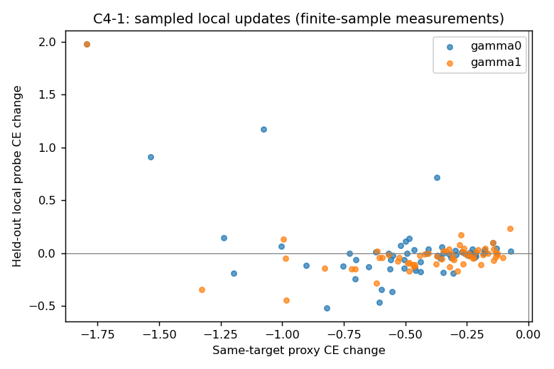
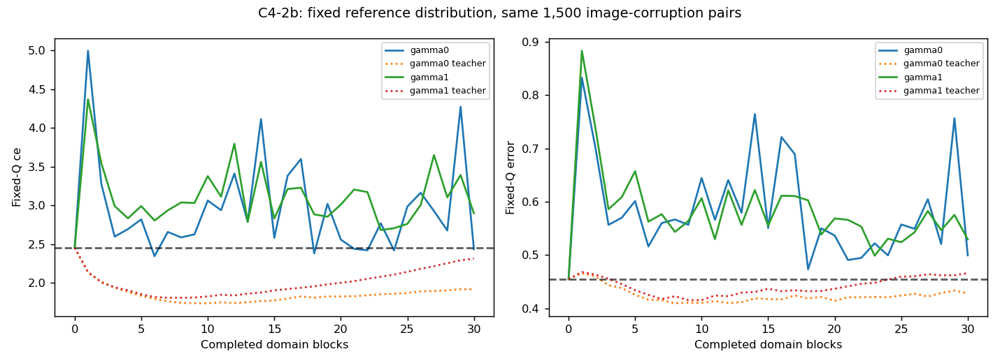
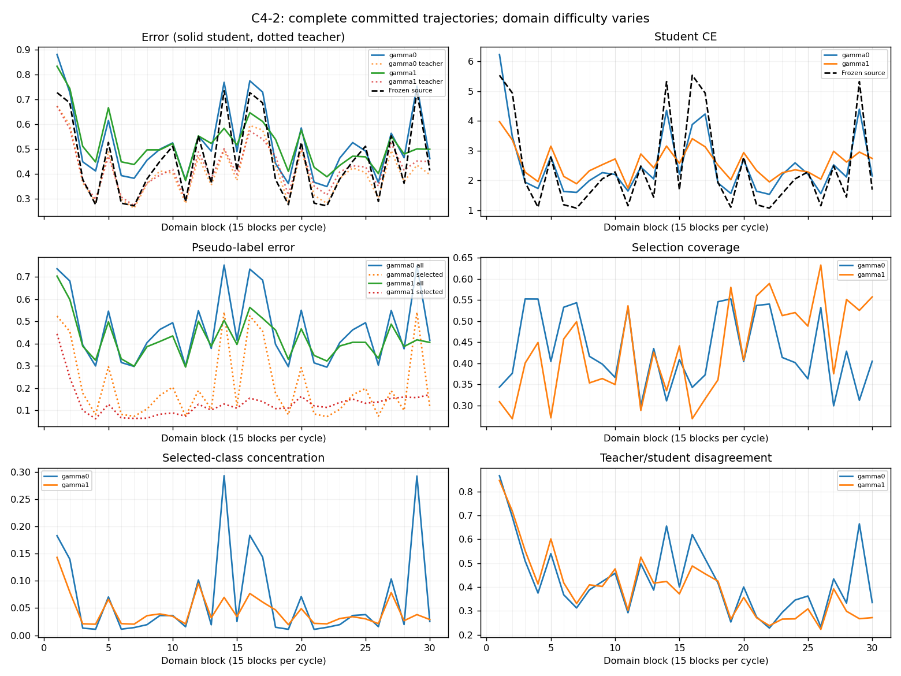
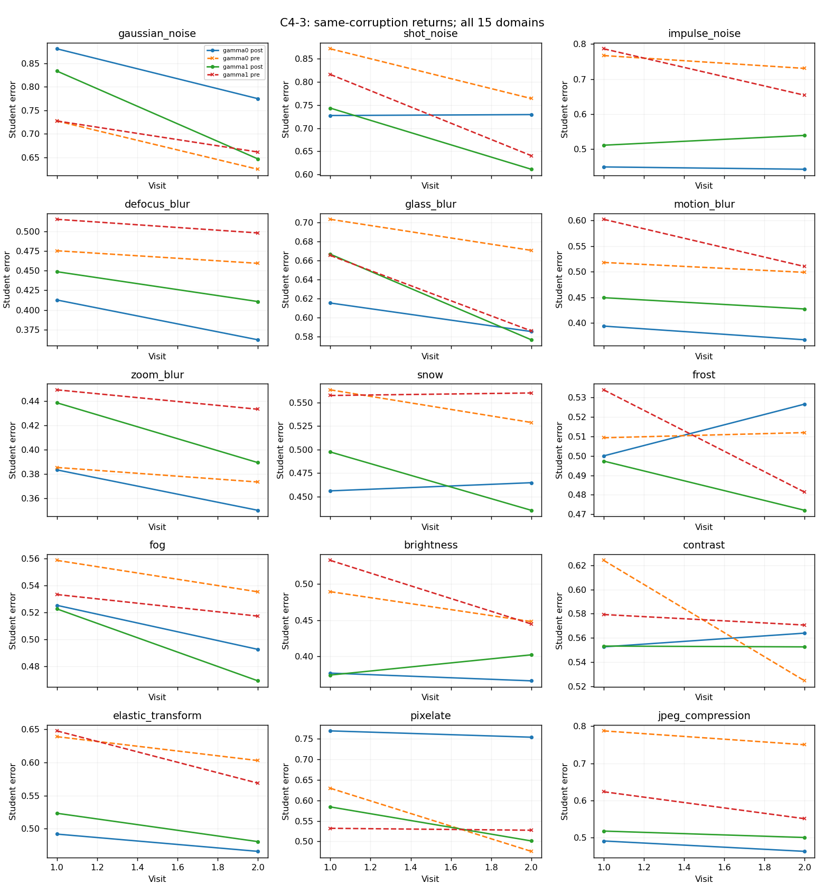
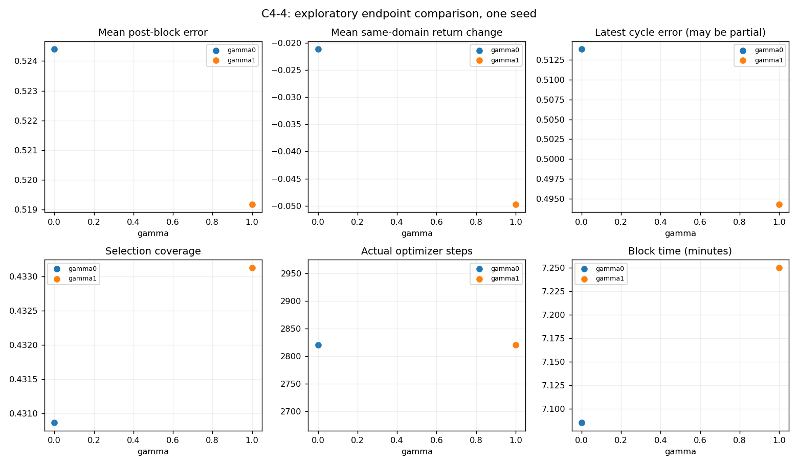

# C4 Exploratory Results Report

September 21, 2026 | Group discussion draft | Aligned with C4 integrated protocol v3

## 1. Executive findings and completed scope

**Stages 0 and 1, and the two prespecified Stage 2 update forks, are complete. Proxy optimization frequently disagrees with labelled local evaluation. Both prespecified long-horizon endpoints exhibit an adverse feedback interaction on fixed-reference cross-entropy (CE). Persistent self-deterioration, a stability boundary, and a phase transition have not been established.**

The candidate after block 5 immediately reduced CE on the fixed reference panel Q by 0.04593. After 1,410 subsequent updates, accepting it under endogenous supervision instead produced CE 0.26629 higher than rejecting it. Under a common supervision tape generated by the reject branch, acceptance remained beneficial by 0.05069. However, intermediate effects repeatedly changed sign: the endpoint does not describe the entire trajectory.

| C4 stage | Protocol requirement | Actual status |
|---|---|---|
| Stage 0 | Algorithm, data isolation, logs, recovery, timing | Complete; 12 software checks and real-data preflight passed |
| Stage 1 | Two feedback endpoints, one seed, two cycles | Complete; 30 blocks and 2,820 updates per arm |
| Stage 2 | Prespecified accept/reject and closed/replay forks | Complete; after blocks 5/15, H=20/94/1410 |
| Stage 3 | Perturbations, finite responses, closure and Jacobian checks | Not run; existing trajectories do not replace this stage |
| Stage 4 | Frozen analysis, new seeds, untouched confirmation audit | Not run; confirmation outcomes remain uninspected |

**This is C4-natural / Type B:** student → EMA teacher → pseudo-labels and confidence selection → next student. Images are exogenous; supervision and selection masks are endogenous. There is no label-based acceptance gate. Executing an update does not mean an evaluator certified its validity. There is no mixture-to-single-heir compression step; inheritance loss and Bayesian hypercompression are not applicable.

### Frozen experimental settings

- CIFAR-100-C, severity 5, all 15 corruptions in a fixed order, repeated twice; seed 101.
- Source: Hendrycks2020AugMix_ResNeXt, 6,900,132 parameters. All student weights train; BN running statistics stay fixed. No stochastic source-weight restoration. This is not full CoTTA.
- Feedback vector γ=(λ,β): only (0,0.001) and (1,0.001). The code's scalar `gamma` denotes λ. At λ=0, training continues with fixed-source supervision; λ=1 uses the evolving EMA teacher.
- SGD: learning rate 0.001, momentum 0.9, weight decay 0; batch size 64; confidence threshold 0.9; one update per nonempty batch.
- Stratified base-image ID split: adaptation 6,000, reserved gate 1,000, exploratory audit 1,500, confirmation audit 1,500. Labels never decide natural adaptation or acceptance.
- Q: the smallest exploratory-audit ID per class, crossed with all 15 corruptions: 100 base images and 1,500 fixed image-corruption pairs. This is an exploratory panel, not an independent confirmation test.

<!-- pagebreak -->

## 2. Stage 0 and C4-1: implementation and local validity

Both arms completed all 2,820 scheduled updates, with no empty-selection batches. A clean-source sanity check on 1,000 adaptation-pool IDs gave 20.8% error and CE 0.78928. This checks the loading path; it is not a new benchmark result.

A uint8 label-indexing bug was repaired before real-data adaptation; shared optimizer momentum across fork restores was repaired before scientific fork runs. Failed preflight artifacts remain separate. Data integrity, full-state restoration, fixed-target loss recomputation, retained records, and replay consistency checks passed. Reported scientific results use the repaired implementation.

### Does reducing the proxy improve the model locally?

Proxy changes use identical images, strong views, pseudo-labels, masks and normalization before/after the update, before EMA refresh. Labelled probes run on the first and last scheduled minibatch of each block, using the same 128 exploratory-audit IDs: 60 probes per arm. The sign tolerance is 10⁻⁶.

| Measurement | λ=0 | λ=1 |
|---|---:|---:|
| All updates: proxy CE decreases | 2,815 / 2,820 | 2,817 / 2,820 |
| All updates: proxy CE increases | 5 / 2,820 | 3 / 2,820 |
| Probes: proxy down, local audit CE down | 38 / 60 | 43 / 60 |
| Probes: proxy down, local audit CE up | 22 / 60 | 17 / 60 |
| Probes: proxy up, local down / local up | 0 / 0 | 0 / 0 |
| Probes: near-zero / empty mask | 0 / 0 | 0 / 0 |

**Observation:** 36.7% of scheduled probes at λ=0 and 28.3% at λ=1 improve the proxy while worsening labelled local CE. This supports a finite-sample evaluation-performance gap. These rates cannot be extrapolated to all updates, and no population-validity guarantee follows. The gap occurs under both supervision sources, so it alone does not identify endogenous feedback as its cause.

<!-- pagebreak -->

## 3. Stage 1 / C4-2b: performance on fixed Q

Every entry below uses the same Q. CE is the protocol's primary mechanism/validity readout; classification error is its benchmark endpoint. Both are retained. The frozen source remains at CE 2.45255 and error 45.47% throughout.

| Time / model | λ=0 CE | λ=0 error | λ=1 CE | λ=1 error |
|---|---:|---:|---:|---:|
| Initial student / teacher | 2.45255 | 45.47% | 2.45255 | 45.47% |
| End of cycle 1: student | 2.58033 | 55.07% | 2.83018 | 55.53% |
| End of cycle 2: student | 2.43198 | 49.93% | 2.89772 | 52.93% |
| End of cycle 1: teacher | 1.77089 | 41.73% | 1.90086 | 43.67% |
| End of cycle 2: teacher | 1.91454 | 42.80% | 2.31199 | 46.60% |

**Student:** At λ=1, endpoint CE exceeds the source and rises between cycle endpoints, while error falls. At λ=0, CE recovers after cycle 1 and ends slightly below the source, but error remains higher. Full trajectories fluctuate and recover; they do not establish persistent deterioration.

**Teacher:** EMA teacher CE is lower than student CE at both cycle endpoints in both arms. At λ=1, teacher CE rises from 1.90086 to 2.31199 but remains below source CE; teacher error ends at 46.60%. Conclusions depend on the evaluated model and loss. Student deterioration cannot be substituted for a claim that the whole system deteriorates. The teacher-student gap is not an inheritance loss here.

**Scope:** Fixed Q removes direct confounding by changing evaluation-domain difficulty. It contains repeated corruption versions of only 100 base images, however. There are no between-seed confidence intervals, and the 1,500 pairs are not 1,500 independent experimental replications.

<!-- pagebreak -->

## 4. C4-2: supervision, selection and full trajectories

Rates below aggregate raw numerators and denominators over the entire run, rather than weighting batches with different selection counts equally. Selected-class concentration is computed per block; its mean and range are reported separately.

| Supervision diagnostic | λ=0 | λ=1 |
|---|---:|---:|
| Pseudo-label error: all presentations | 46.85% | 42.31% |
| Pseudo-label error: selected presentations | 19.08% | 12.84% |
| Selection coverage | 43.09% | 43.31% |
| Selected / total presentations | 77,555 / 180,000 | 77,964 / 180,000 |
| Teacher/student argmax disagreement | 42.91% | 39.98% |
| Mean selected-class concentration | 0.0663 | 0.0439 |
| Concentration range across blocks | 0.0108–0.2929 | 0.0195–0.1429 |
| Optimizer updates / empty batches | 2,820 / 0 | 2,820 / 0 |

**Observation:** λ=1 has lower aggregate pseudo-label noise and similar coverage, yet higher final student Q-CE. A simple account based on higher average pseudo-label error therefore does not explain the endpoint difference. Error identity, confidence, timing and selection distributions may matter; their individual effects are not identified here.

Current-domain risk varies partly because each block has a different corruption. Concentration measures label imbalance, not harmful collapse by itself. Teacher error is shown separately; teacher CE is retained in the block tables and reported on fixed Q in Section 3.

<!-- pagebreak -->

## 5. C4-3: returns to the same corruption

The return contrast is post-adaptation error on visit 2 minus visit 1, using the same corruption and audit IDs. Negative values indicate improvement; pp denotes percentage points.

At λ=0, the mean over 15 domains is **−2.12 pp**, with 11 improving and 4 worsening domains. At λ=1, it is **−4.97 pp**, with 13 improving and 2 worsening domains. These comparisons favor recovery/improvement overall. Two visits neither establish a long-term trend nor locate a turning point.

Adverse changes at λ=0 are frost +2.67, contrast +1.13, snow +0.87 and shot noise +0.20 pp. At λ=1, impulse noise and brightness each worsen by +2.80 pp. The largest improvements are on Gaussian noise: −10.60 and −18.67 pp, respectively. All 15 domains are shown below, including favorable outcomes.

<!-- pagebreak -->

## 6. C4-4: the parameter slice and actual cost

Only γ=(0,0.001) and (1,0.001) were run. Mean post-block risk averages performance immediately after adapting to each domain. It is neither the fixed-Q endpoint nor a reevaluation of the final model across all domains.

| Measurement | λ=0 | λ=1 |
|---|---:|---:|
| Mean student post-error, all 30 blocks | 52.44% | 51.92% |
| Mean student post-error, cycle 1 | 53.50% | 54.40% |
| Mean student post-error, cycle 2 | 51.38% | 49.43% |
| Mean teacher post-error, all 30 blocks | 41.13% | 42.56% |
| Mean student post-CE, all 30 blocks | 2.52751 | 2.58991 |
| Mean teacher post-CE, all 30 blocks | 1.70928 | 1.83773 |
| Block computation time, two cycles | 7.09 min | 7.25 min |

The corresponding mean current-domain source error is 45.68%, with CE 2.43707. Model choice, temporal aggregation and loss change the ranking. λ=1 is not uniformly worse than λ=0. Two λ endpoints do not identify a continuous feedback gain or a critical boundary.

The natural pilot ran on two RTX 4090s in parallel. Block timings include audits/checkpoints, but exclude full setup and transport. Short replications and H1410 then ran on two Sapelo zhai_p L40S GPUs. The Slurm allocation lasted 25 min 35 s; each long fork took about 15.4–15.9 min, with parents running in parallel. L40S peak allocated/reserved memory was 2.093/2.800 GB per worker. Peak memory was not instrumented for the original 4090 pilot. Vast was destroyed; estimated total cost is $1.0–1.2, not a final invoice.

<!-- pagebreak -->

## 7. Stage 2 / C4-5: isolating a feedback contrast

At checkpoints after blocks 5 and 15 of cycle 1, the first nonempty next-domain update was the candidate. Both nodes were specified before their outcomes and reported regardless of local sign. Accept/reject states include the complete student, teacher and optimizer; continuations share future image and augmentation keys.

A closed-loop continuation from the reject state first generates a reference tape: target probabilities, pseudo-labels, confidence masks and input keys. Accept/replay uses this external tape; its own teacher supplies neither training targets nor masks. **Replay continues learning. It cuts the student's influence on future supervision; it does not freeze the learner or merely fix the already-exogenous image stream.**

Let L denote student CE on fixed Q:

- A_cl(h) = L_accept,closed(h) − L_reject,closed(h): the descendant effect of accepting under endogenous supervision.
- A_ol(h) = L_accept,replay(h) − L_reject,replay(h): the effect under common external supervision.
- I(h) = A_cl(h) − A_ol(h): the feedback interaction under this intervention. Positive values mean acceptance has a worse effect in closed loop.

Reject/replay and reject/closed were explicitly checked for equality over the first 20 steps. Their later equivalence follows from the deterministic recurrence, allowing reuse of the reject path. Three full branches were run; a fourth full branch was not independently executed.

| Parent | Future steps h | A_cl | A_ol | I |
|---|---:|---:|---:|---:|
| Block 5 | 0 (immediate) | −0.045932 | −0.045932 | 0 |
| Block 5 | 20 | +0.005858 | +0.005858 | 0 |
| Block 5 | 94 | −0.119639 | −0.116541 | −0.003098 |
| Block 5 | 1,410 | +0.266292 | −0.050690 | +0.316982 |
| Block 15 | 0 (immediate) | +0.046558 | +0.046558 | 0 |
| Block 15 | 20 | +0.036279 | +0.036013 | +0.000266 |
| Block 15 | 94 | +0.138922 | +0.443354 | −0.304432 |
| Block 15 | 1,410 | +0.069601 | −0.052072 | +0.121673 |

All table values are from Sapelo. H20/H94/H1410 share prefixes and are not independent replications. H94 contrasts agree between 4090 and L40S within 4.77×10⁻⁷: numerical reproducibility does not increase the scientific sample size.

**The block-5 short reversal is not attributable to feedback:** at h=5/20, closed and replay acceptance effects coincide. At h=94, acceptance is beneficial again. The prespecified long endpoint exhibits the joint pattern of immediate benefit, adverse closed-loop descendants, and beneficial replay descendants.

<!-- pagebreak -->

## 8. C4-5: full curves and interpretation

**Both prespecified H1410 endpoints have positive I, but feedback is not uniformly harmful along either trajectory.** Both H94 interactions are negative, with further sign changes at intermediate audits. The result concerns specific parents, supervision interventions and horizons; it is not a monotone law of error amplification.

H1410 equals 15 domains × 94 batches. Because the focal candidate consumes the first batch of its domain, the end of the fifteenth continuation domain block is at h=1409. Interactions there are also positive: +0.237884 and +0.211858. Both times are retained to distinguish a cycle-length budget from the exact domain-block boundary; neither removes the intermediate reversals.

Relative to the reject tape, accepted closed-loop continuations change 9,252 / 6,892 pseudo-label events and 4,111 / 3,683 mask events for blocks 5 / 15. These count repeated sample presentations. The intervention fixes targets and masks jointly, so it does not identify their separate contributions.

<!-- pagebreak -->

## 9. Absolute deterioration, relative harm and next steps

### Absolute performance does not uniformly deteriorate

| Parent / path | Initial CE | H1410 CE | Initial error | H1410 error |
|---|---:|---:|---:|---:|
| 5 / reject closed | 2.99013 | 2.78637 | 65.73% | 55.27% |
| 5 / accept closed | 2.94420 | 3.05266 | 64.67% | 56.73% |
| 5 / accept replay | 2.94420 | 2.73568 | 64.67% | 51.33% |
| 15 / reject closed | 2.83018 | 2.76474 | 55.53% | 50.47% |
| 15 / accept closed | 2.87674 | 2.83434 | 56.40% | 52.13% |
| 15 / accept replay | 2.87674 | 2.71267 | 56.40% | 53.07% |

Every path improves error from its own initial state. Block 15 accept/closed even has lower endpoint error than accept/replay despite higher CE. **Worse than rejecting, worse under feedback than replay, and continuously rising absolute risk are distinct claims. Selected prespecified comparisons support the first two, not the third.**

| Target claim | Current evidence |
|---|---|
| Proxy/local labelled disagreement | Observed on scheduled finite-sample probes |
| Immediate benefit, worse later descendants | Observed for block 5 on fixed-Q CE |
| Additional harm relative to specified replay | Observed at both H1410 endpoints; intermediate directions vary |
| Persistent recursive deterioration | Not established; returns generally improve and trajectories recover |
| Closed four-dimensional diagnostic dynamics | Untested; diagnostic measurements alone do not establish closure |
| Jacobian, spectral radius or phase boundary | Not estimated or validated; C4-6/7 remain unrun |
| Hypercompression or lossy inheritance | Not applicable to this implementation |
| General RSI result or benchmark superiority | Unsupported by one seed, one dataset and simplified CTTA |

**Recommended next experiment: replicate the frozen setup across seeds.** Keep the two parent checkpoints, λ/β, H94/H1410 and both metrics; prespecify reporting of endpoints and complete audit trajectories. First assess reproducibility on the exploratory audit. If proceeding to Stage 4, freeze the primary contrast, meaningful effect threshold and analysis before using seeds 303/404/505/606/707 and the untouched confirmation audit. No success threshold has yet been established by these data.

If the endpoint interaction replicates, separate target and mask interventions. Stage 3 additionally requires independent student/teacher perturbations, scale and rank/conditioning checks, momentum-based closure tests and held-out response predictions. Fitting a VAR to the existing trajectories does not complete it. If replication is unstable, retain the negative findings and do not escalate to a persistent-deterioration claim.

<!-- pagebreak -->

## 10. Evidence, deliverables and provenance

This report presents verified outcomes aligned with integrated C4 v3. Evidence comes from `Delivery/RESULTS.md`, machine-readable summaries and fork completion/verification records. Preparing this English report involved no new GPU experiments.

| Deliverable | Location / contents |
|---|---|
| Current protocol | `Protocol.tex/pdf`, integrated v3; hash matches Downloads/C4.tex |
| Pilot tables | `Delivery/results/report/blocks.json`, `updates.jsonl`, `local_sign_counts.json`, `summary.json` |
| C4-1 through C4-4 | All five figures in Sections 2–6, including fixed-Q figure C4-2b |
| C4-5 | `Delivery/sapelo_results/after{5,15}_h{20,94,1410}/`: comparisons, metrics, runtime and verification |
| Unrun deliverables | C4-gated, C4-6 dynamics, C4-7 parameter map and independent confirmation |
| Full intermediate evidence | Batch predictions, pseudo-labels/probabilities, masks, IDs, augmentation keys, complete checkpoints, failed attempts and logs |
| Repository | `mivolis/RSI2RSD`, branch `experiment/C4`, directory `C4/`; main unchanged |

Sapelo job 48416583 completed with exit 0:0. Each H1410 fork passed verification of 4,364 hashed files and 4,230 future batch records. Canonical outputs are at `/scratch/yz54720/RSI2RSD/C4/migration_results/job48416583/`. All 7,250 required Vast files were recovered and verified before instance destruction.

**Computation and artifact publication have separate statuses.** Summaries, figures, configurations and verification records were delivered in result commit `790d6a68bca12ee0ffbc98196a31b63a91b6c677`. Bulk attachments were still in the upload/mirroring workflow at report preparation; a compact-results commit does not mean all raw files are downloadable. Current availability is tracked in `ARTIFACTS.md`.

Repository entry point:

https://github.com/mivolis/RSI2RSD/tree/experiment/C4/C4

### Suggested meeting conclusion

In this natural CTTA learner, decreasing the pseudo-label objective does not guarantee improved local labelled risk. A prespecified fork also provides an example of an immediately beneficial update with worse closed-loop descendants at a specified long horizon; common-supervision replay links that descendant contrast to the endogenous supervision channel. However, effects change sign over time, CE and error disagree, and same-domain returns improve overall. The next justified step is to replicate and delimit this finite-horizon phenomenon, rather than claim persistent self-deterioration or a phase transition.
