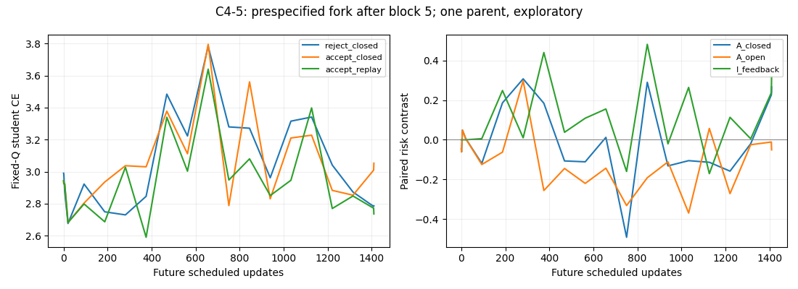
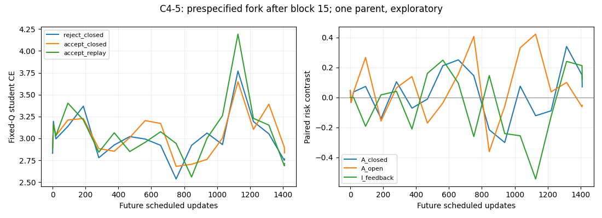

# C4 exploratory results — 2026-09-21

**Completed:** paired natural pilot (30 blocks and 2,820 updates per arm), plus
the two prespecified forks at horizons 20, 94 and 1,410. One seed (101), severity 5,
two natural corruption cycles. Sapelo job 48416583 completed with exit 0;
all six host-specific fork verifications passed. All required Vast records
were recovered and hash-verified before the paid instance was destroyed.
The full Sapelo mirror and both complete raw archives are now hash-verified;
the Vast raw release is published with all 15 displayed asset hashes matched,
while the Sapelo raw release upload remains in progress;
see [ARTIFACTS.md](ARTIFACTS.md) for availability boundaries.

## Natural trajectories

Lower values are better. Lambda is the source/EMA mixing weight (`--gamma`).
The fixed reference Q always contains the same 1,500 image-corruption pairs.

| Measure | Frozen source | Lambda 0 | Lambda 1 |
|---|---:|---:|---:|
| Initial fixed-Q CE | 2.45255 | 2.45255 | 2.45255 |
| Fixed-Q CE after cycle 1 | 2.45255 | 2.58033 | 2.83018 |
| Fixed-Q CE after cycle 2 | 2.45255 | 2.43198 | 2.89772 |
| Fixed-Q error after cycle 2 | 45.47% | 49.93% | 52.93% |
| Mean same-domain error change, visit 2 minus visit 1 | — | -2.12 pp | -4.97 pp |
| Selected adaptation samples | — | 43.09% | 43.31% |

Both arms exhibit large transient changes and recovery. These are not monotone
deterioration trajectories. Same-domain return error improves in both arms,
while the lambda=1 fixed-Q CE endpoint is worse than the source and increases
slightly from cycle 1 to cycle 2. CE and error answer different questions and
must both be retained. Changing domains must not be confused with learner drift.

Proxy CE falls in 2,815/2,820 lambda=0 updates and 2,817/2,820 lambda=1 updates.
Among the 60 scheduled local probes per arm, proxy CE falls while current-domain
held-out probe CE rises in 22 (lambda 0) and 17 (lambda 1). These finite-sample
measurements demonstrate proxy/audit disagreement, not population-valid updates.

## Prespecified update forks

All values below are fixed-Q CE differences. `A_closed` and `A_open` compare
accepting with rejecting the candidate under endogenous and replayed targets;
`I_feedback = A_closed - A_open`. Positive means a worse effect of acceptance.

| Parent checkpoint | Immediate effect | A_closed at H94 | A_open at H94 | I_feedback at H94 |
|---|---:|---:|---:|---:|
| After block 5 | -0.04593 | -0.11964 | -0.11654 | -0.00310 |
| After block 15 | +0.04656 | +0.13892 | +0.44335 | -0.30443 |

The block-5 candidate improves Q immediately but is worse than rejection at
H5 and H20. Closed and replay effects are identical at these short endpoints,
so that reversal does **not** identify feedback amplification. At H94 the
candidate is beneficial again. The block-15 candidate is immediately harmful;
at H94 endogenous feedback reduces its relative harm compared with this replay
intervention. Neither fork supports a uniform harmful-feedback explanation.

Both nodes were specified before outcomes. H20 and H94 repeat prefixes of the
same forks and are not independent replications. Reject/replay identity is
explicitly verified over the first 20 steps; longer equality is an implication
of the deterministic recurrence, not an independently executed fourth branch.

## Integrity and scope

- All 60 pilot blocks have checksummed completion markers and raw batch records.
- Each fork retains complete accept/reject states, future schedules, target
  probabilities, labels, masks, predictions and full checkpoints at audit nodes.
- Independent verification reconstructs losses from logits, checks the replay
  tape and sample keys, and recomputes reported contrasts.
- Official dataset MD5 and lossless extraction hashes passed. A clean source
  sanity check used 1,000 adaptation-pool IDs only (20.8% error); confirmation
  outcomes remain untouched.
- Initial preflight hit a uint8-label indexing bug before adaptation. The repair
  and regression tests are on the experiment branch; failed artifacts remain.
- Pilot compute took 7.09/7.25 minutes per arm. Peak VRAM was not instrumented;
  observed running allocations were about 2.8 GB per GPU, not a peak estimate.

No hypercompression, inheritance-loss, Jacobian, phase-transition, independent
replication, benchmark-superiority or general RSI claim is established here.
The natural algorithm is a simplified, explicitly specified CTTA learner, not
an implementation of full CoTTA.

## Full-cycle extension on Sapelo

The same two parents were continued for 1,410 scheduled updates on two L40S GPUs.
Each extension took approximately 15.4–15.9 minutes for its three sequential
continuations, running the two parents in parallel. The whole Slurm allocation,
including setup, short replication and verification, took 25 minutes 35 seconds.
Peak allocated/reserved memory was 2.093/2.800 GB per worker.
H94 host-replication contrasts agreed with Vast within 4.77e-7; these are repeated
computations of the same seed, not independent scientific replications.

| Parent | Immediate CE effect | A_closed at H1410 | A_open at H1410 | I_feedback at H1410 |
|---|---:|---:|---:|---:|
| After block 5 | -0.045932 | +0.266292 | -0.050690 | +0.316982 |
| After block 15 | +0.046558 | +0.069601 | -0.052072 | +0.121673 |

Both prespecified full-cycle endpoints show a harmful feedback interaction on
fixed-Q CE: accepting is worse than rejecting under endogenous supervision,
but better under the rejection-generated replay tape. The block-5 update was
initially beneficial on this panel, making it a candidate example of an
immediate gain followed by a worse descendant at the specified horizon.

This is **finite-horizon, intervention-specific evidence**, not persistent
self-deterioration. Both contrasts change sign repeatedly between audit points.
At H94, both interactions were negative. No endpoint or parent was selected
after observing the result, and all intermediate signs are retained.

| Parent / path | Fixed-Q CE initially | CE at H1410 | Error initially | Error at H1410 |
|---|---:|---:|---:|---:|
| Block 5 / reject closed | 2.990129 | 2.786371 | 65.73% | 55.27% |
| Block 5 / accept closed | 2.944197 | 3.052662 | 64.67% | 56.73% |
| Block 5 / accept replay | 2.944197 | 2.735680 | 64.67% | 51.33% |
| Block 15 / reject closed | 2.830183 | 2.764742 | 55.53% | 50.47% |
| Block 15 / accept closed | 2.876741 | 2.834343 | 56.40% | 52.13% |
| Block 15 / accept replay | 2.876741 | 2.712670 | 56.40% | 53.07% |

Error improves from its own starting point on every path. For block 15,
accept/closed even has lower endpoint error than accept/replay despite higher CE.
Thus the CE interaction must not be described as uniform degradation across
metrics. Raw probabilities are retained to investigate this difference.

Each full-cycle fork passed checks for 4,364 hashed files and 4,230 future batch
records. Closed acceptance changed 9,252/6,892 pseudo-labels and 4,111/3,683 masks
relative to the rejection tape (blocks 5/15); these are counts of repeated sample
events, not independent observations. The intervention jointly fixes labels and
selection masks; it does not isolate either channel individually.

## Next decision

The frozen pilot and its prespecified extension are complete; no GPU job remains.
Preserve the mixed results. A useful next study would repeat this frozen setup
with independent seeds and prespecified time summaries, then separate label and
mask feedback. That is a subsequent research decision, not a result of this run.
Do not fit a Jacobian or tune parameters to force the desired deterioration.

The original pilot summaries are in `compact_results.tar.gz`; all six Sapelo
fork summaries, full-cycle curves and verification records are in
`sapelo_compact_results.tar.gz`. Bulk checkpoints/predictions are indexed in
[ARTIFACTS.md](ARTIFACTS.md), with completed recovery distinguished from upload.
